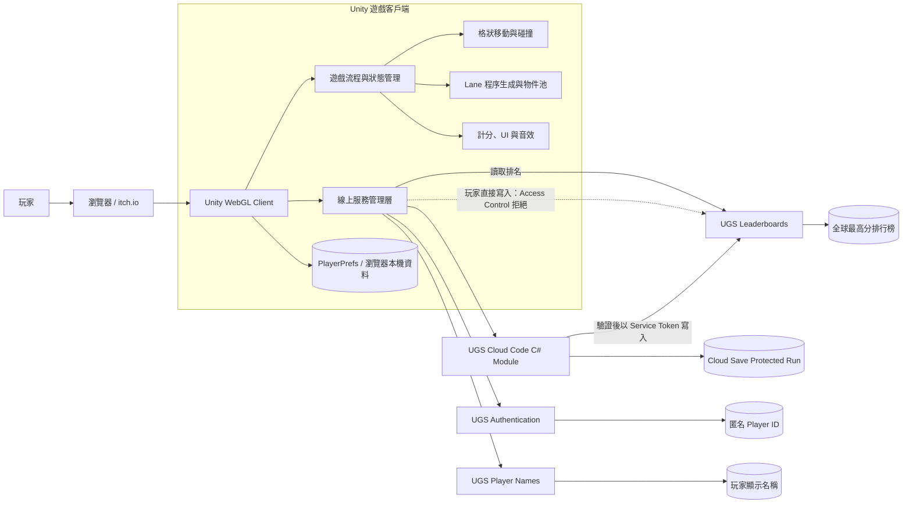

# Cross The Road

一款以 Unity 6 與 C# 製作、受到經典過馬路玩法啟發的 2D 無限前進網頁遊戲。玩家需要穿越公路、河流與鐵路，避開車輛及火車，並持續刷新最高分與線上排行榜。

## 立即遊玩

**[在 itch.io 遊玩 Cross The Road](https://789jacobis.itch.io/cross-the-road)**

目前已發布經過一般與無痕瀏覽器驗證的 Unity Web Release Build，並完成 Cloud Code 成績驗證與排行榜寫入保護。

## 遊戲畫面

### 主選單


### 遊戲與線上排行榜

<p align="center">
  
  
</p>

## 目前完成的功能

### 遊戲玩法

- 上、下、左、右格狀移動與跳躍動畫。
- 按照玩家進度持續生成並回收道路區段。
- 草地、公路、河流與鐵路 Lane。
- 汽車、卡車、巴士、浮木、火車及固定障礙物。
- 車輛、浮木與火車物件池。
- 碰撞、落水、死亡、重新開始、暫停與倒數流程。
- 依前進最遠距離計分，避免後退重複得分。
- 隨進度調整的難度階段。

### UI 與音效

- 主選單、玩家名稱輸入、排行榜、暫停與遊戲結束畫面。
- 鍵盤與滑鼠 UI 操作。
- 音樂與音效統一開關，設定會保存在本機。
- 主選單與遊戲中的背景音樂，以及跳躍、碰撞、落水、火車等音效。
- Web 版本支援中文輸入法與中文玩家名稱。

### 線上功能

- Unity Authentication 匿名玩家身分。
- Unity Player Names 顯示名稱。
- Unity Leaderboards 全球最高分排行榜。
- 顯示最高分玩家；玩家不在前段名次時，以省略列加上自己的排名。
- 同分玩家顯示並列名次。
- 每局開始時由 Cloud Code 簽發一次性 `RunId`。
- 遊戲結束後由 Cloud Code 檢查玩家、`RunId`、提交次數、分數範圍、執行時間與得分速度。
- 通過驗證後，僅由 Cloud Code 使用服務權杖寫入排行榜。
- Access Control 禁止玩家端直接寫入 Leaderboards，同時保留排行榜讀取能力。

### 發布狀態

- 已建立非 Development 的 Runtime Speed Web Release Build。
- 已部署至 itch.io，並以未登入的無痕瀏覽器驗證公開存取。
- 支援頁面內嵌遊玩與全螢幕模式。

## 操作方式

| 操作 | 按鍵 |
| --- | --- |
| 移動 | 方向鍵或 WASD |
| UI 選擇 | 方向鍵／W、S |
| UI 確認 | Enter／Space 或滑鼠左鍵 |
| 暫停 | 畫面右上角暫停按鈕 |

## 技術與版本

- Unity `6000.3.10f1 LTS`
- Universal Render Pipeline 2D
- C#
- Unity Input System
- TextMesh Pro
- Unity Gaming Services：Authentication、Player Names、Leaderboards
- Unity Cloud Code C# Modules、Cloud Save Protected Data、Access Control
- .NET 9（Cloud Code 模組開發與測試）
- WebGL Input（處理瀏覽器中的 IME／中文輸入）
- 最終平台：Unity Web Build

## 系統架構



Unity 客戶端直接完成匿名登入、玩家名稱與排行榜讀取，但不能直接寫入分數。每局開始與結束都會呼叫 Cloud Code；模組將執行中的 `RunId` 保存在 Cloud Save Protected Data，驗證通過後才以服務權杖更新排行榜。本機最高分與音效設定保存在瀏覽器的 PlayerPrefs。

詳細元件與成績提交流程請參考 [`docs/ARCHITECTURE.md`](docs/ARCHITECTURE.md)。

## 專案結構

```text
Assets/
  Animations/       動畫與 Animator 資源
  Art/              角色、環境、車輛與 UI 美術
  Audio/            背景音樂與音效
  Data/             ScriptableObject 與遊戲設定資料
  Fonts/            中文字型與 TMP Font Asset
  Prefabs/          遊戲物件 Prefab
  Scenes/           遊戲場景
  Scripts/          遊戲、UI、音效與線上服務程式碼
  CloudCode/        模組參照、產生的客戶端綁定與 Access Control 規則
CrossyRoadServer/   Cloud Code C# 模組與測試專案
Packages/           Unity 套件清單與鎖定檔
ProjectSettings/    Unity 專案設定
```

`Library/`、`Temp/`、`Logs/`、`UserSettings/` 與 `Builds/` 都是本機或建置產物，不會提交到 Git。

## 在 Unity Editor 執行

1. 安裝 Unity Hub 與 Unity Editor `6000.3.10f1 LTS`。
2. 為該 Editor 安裝 Web Build Support。
3. 用 Unity Hub 開啟此 repository 根目錄。
4. 等待 Unity 還原 Packages 並完成首次匯入。
5. 開啟 `Assets/Scenes/SampleScene.unity`。
6. 按下 Play 測試遊戲。

線上功能需要專案連結至對應的 Unity Cloud Project，並在 UGS Dashboard 建立 ID 為 `global_high_scores` 的 Leaderboard。`CrossyRoadServer` Cloud Code 模組與 `CrossyRoadAccessControl.ac` 也必須部署到相同環境。沒有可用的 UGS 環境時，核心遊戲仍可執行，但線上名稱、伺服器驗證與排行榜功能會不可用。

## 建置 Web 版本

1. 在 Unity 選擇 `File > Build Profiles`。
2. 選擇 `Web` 並切換平台。
3. 確認 `Assets/Scenes/SampleScene.unity` 位於 Scene List。
4. Player Settings 的預設 Canvas 建議使用 `960 × 540`。
5. 關閉 Development Build，將 Code Optimization 設為 Runtime Speed。
6. 按下 Build，輸出到被 Git 忽略的 `Builds/Release/` 資料夾。
7. 將 `Release` 內的內容壓成 ZIP，確保 `index.html` 位於 ZIP 根目錄，再上傳至 itch.io。
8. 使用本機 HTTP server 或網站平台提供服務；Web Build 不能直接以 `file://` 正確執行。

## 後端取捨與安全性

目前的排行榜採用伺服器驗證流程：

1. `StartRun` 建立隨機且一次性的 `RunId`，並將開始時間與使用狀態寫入 Protected Data。
2. `SubmitRunScore` 驗證登入玩家、分數範圍、`RunId`、是否重複提交、最長遊戲時間及最高合理得分速度。
3. Cloud Code 使用 Service Token 寫入 `global_high_scores`。
4. Access Control 封鎖 `Player` 對 Leaderboards 的所有 `Write`，但允許讀取。

此設計已實際驗證：玩家端直接呼叫 Leaderboards 寫入會收到 `Access has been restricted`，正常遊戲則能由伺服器驗證並提交。它能阻擋直接偽造成績與重放同一局，但仍不是完整的伺服器權威模擬；若要進一步提高競技安全性，可增加事件紀錄、速率限制、異常偵測與人工稽核。

## 下一步

- 為 `StartRun`、`SubmitRunScore` 與驗證規則補齊單元測試。
- 增加服務層介面與測試替身，降低 Unity 客戶端與 UGS 的耦合。
- 建立 GitHub Actions，檢查 Cloud Code build/test 與 Unity 專案基本品質。
- 補上短版遊戲展示影片。
- 視需求加入提交速率限制、異常紀錄與排行榜管理工具。
