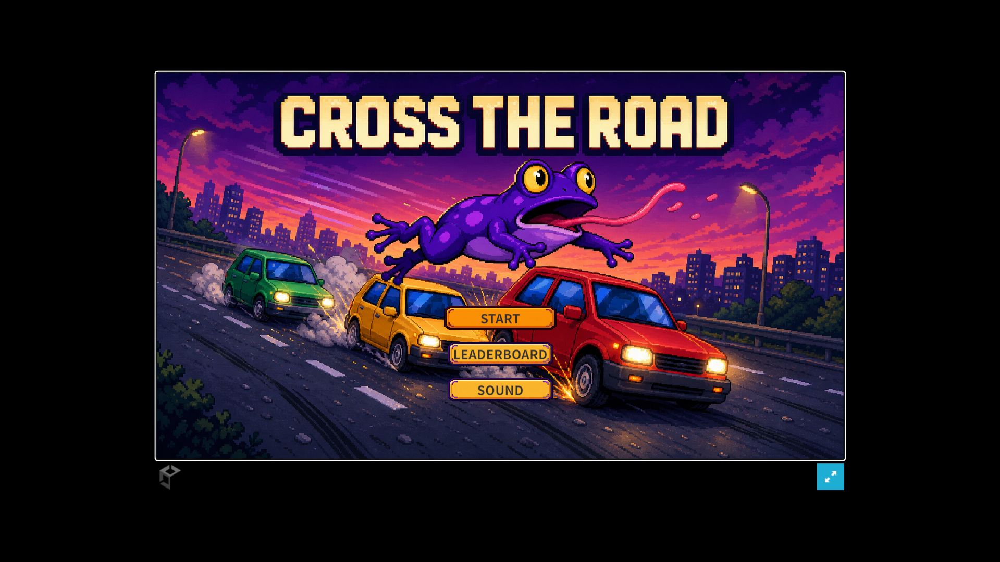
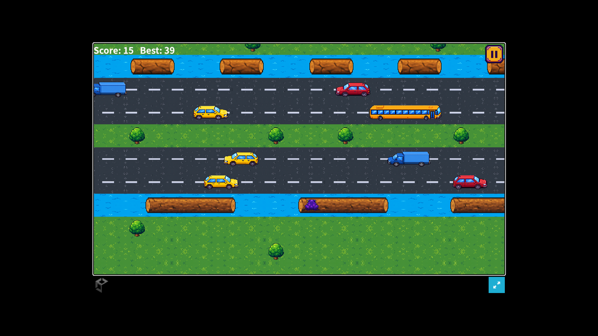
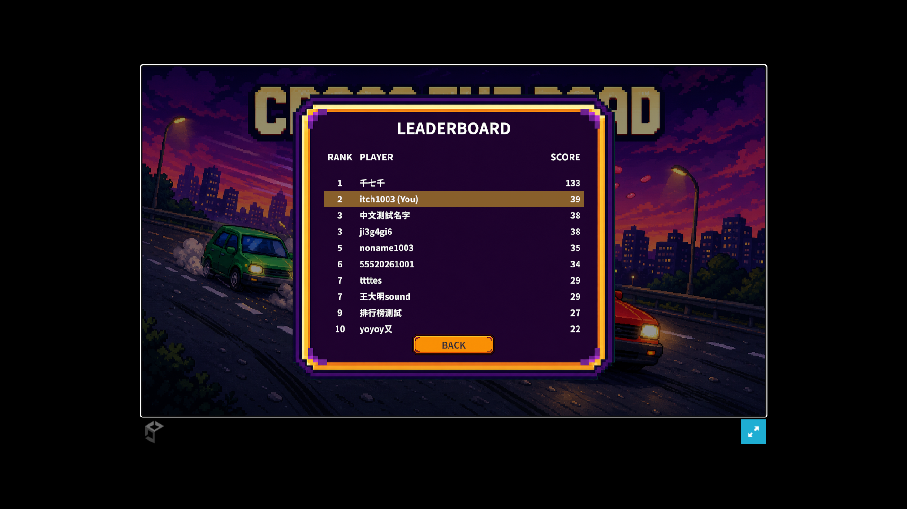
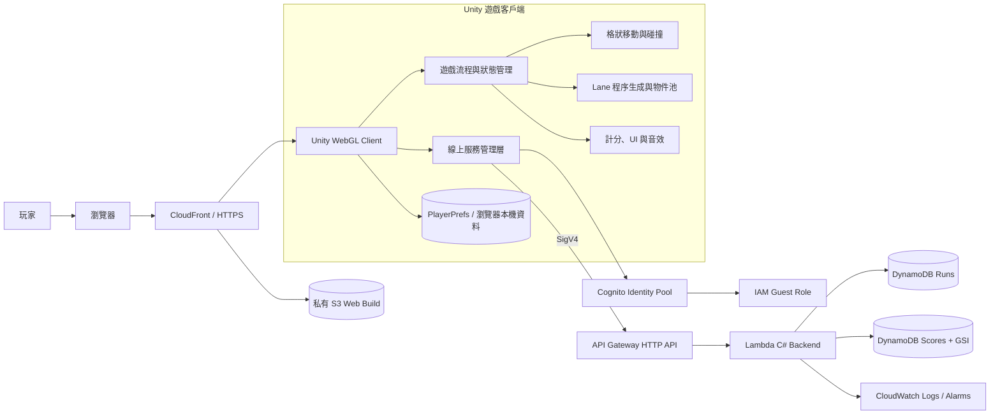

# Cross The Road

一款以 Unity 6 與 C# 製作、受到經典過馬路玩法啟發的 2D 無限前進網頁遊戲。玩家需要穿越公路、河流與鐵路，避開車輛及火車，並持續刷新最高分與線上排行榜。

## 立即遊玩

**[在 AWS CloudFront 遊玩 Cross The Road](https://d3gh9bawx8sr7b.cloudfront.net)**

[itch.io 發布頁](https://789jacobis.itch.io/cross-the-road)保留作為替代入口。

目前正式版本由 AWS 提供靜態網站、匿名身分、伺服器端成績驗證與排行榜，並已通過一般及無痕瀏覽器驗證。

## 遊戲畫面

### 主選單



### 遊戲與線上排行榜

<p align="center">
  
  
</p>

## 目前完成的功能

### 遊戲玩法

- 上、下、左、右格狀移動與跳躍動畫。
- 按照玩家進度持續生成並回收道路區段。
- 草地、公路、河流與鐵路 Lane。
- 汽車、卡車、巴士、浮木、火車及固定障礙物。
- 車輛、浮木與火車物件池。
- 碰撞、落水、死亡、重新開始、暫停與倒數流程。
- 依前進最遠距離計分，避免後退重複得分。
- 隨進度調整的難度階段。

### UI 與音效

- 主選單、玩家名稱輸入、排行榜、暫停與遊戲結束畫面。
- 鍵盤與滑鼠 UI 操作。
- 音樂與音效統一開關，設定會保存在本機。
- 主選單與遊戲中的背景音樂，以及跳躍、碰撞、落水、火車等音效。
- Web 版本支援中文輸入法與中文玩家名稱。

### 線上功能

- Amazon Cognito Identity Pools 匿名玩家身分與短期憑證。
- Amazon API Gateway HTTP API 與 SigV4 請求簽章。
- AWS Lambda（.NET 10）伺服器端回合與分數驗證。
- Amazon DynamoDB 全球最高分排行榜。
- 顯示最高分玩家；玩家不在前段名次時，以省略列加上自己的排名。
- 同分玩家顯示並列名次。
- 每局開始時由 Lambda 簽發一次性 `RunId`。
- 遊戲結束後由 Lambda 檢查玩家、`RunId`、提交次數、分數範圍、執行時間與得分速度。
- 玩家 IAM Role 只能呼叫指定 API，不能直接存取 DynamoDB、Lambda 或 S3。

### 發布狀態

- 已建立非 Development 的 Runtime Speed Web Release Build。
- 已部署至私有 S3 Bucket，並透過 CloudFront OAC、HTTPS 與 CDN 對外提供。
- 已部署至 itch.io，並以未登入的無痕瀏覽器驗證公開存取。
- 支援頁面內嵌遊玩與全螢幕模式。

## 操作方式

| 操作 | 按鍵 |
| --- | --- |
| 移動 | 方向鍵或 WASD |
| UI 選擇 | 方向鍵／W、S |
| UI 確認 | Enter／Space 或滑鼠左鍵 |
| 暫停 | 畫面右上角暫停按鈕 |

## 技術與版本

- Unity `6000.3.10f1 LTS`
- Universal Render Pipeline 2D
- C#
- Unity Input System
- TextMesh Pro
- AWS：CloudFront、S3、Cognito Identity Pools、API Gateway、Lambda、DynamoDB、CloudWatch、SNS、Budgets
- AWS CDK v2（C#）
- .NET 10（Lambda）、.NET 9（基礎設施與測試）
- WebGL Input（處理瀏覽器中的 IME／中文輸入）
- 最終平台：Unity Web Build

## 系統架構



Unity 客戶端向 Cognito 取得匿名身分與短期憑證，再以 SigV4 呼叫受 IAM 保護的 API。每局開始與結束都會經過 Lambda；`RunId`、使用狀態與最高分由 DynamoDB 保存，客戶端沒有資料表寫入權限。本機最高分與音效設定保存在瀏覽器的 PlayerPrefs。

目前正式架構請參考 [`docs/ARCHITECTURE.md`](docs/ARCHITECTURE.md)；AWS Serverless 的設計決策、安全邊界與遷移紀錄請參考 [`docs/AWS_TARGET_ARCHITECTURE.md`](docs/AWS_TARGET_ARCHITECTURE.md)。

## 專案結構

```text
Assets/
  Animations/       動畫與 Animator 資源
  Art/              角色、環境、車輛與 UI 美術
  Audio/            背景音樂與音效
  Data/             ScriptableObject 與遊戲設定資料
  Fonts/            中文字型與 TMP Font Asset
  Prefabs/          遊戲物件 Prefab
  Scenes/           遊戲場景
  Scripts/          遊戲、UI、音效與線上服務程式碼
  CloudCode/        模組參照、產生的客戶端綁定與 Access Control 規則
CrossyRoadServer/   共用驗證領域、AWS Lambda、舊版 Cloud Code 與測試
infrastructure/     AWS CDK C# production 基礎設施與測試
Packages/           Unity 套件清單與鎖定檔
ProjectSettings/    Unity 專案設定
```

`Library/`、`Temp/`、`Logs/`、`UserSettings/` 與 `Builds/` 都是本機或建置產物，不會提交到 Git。

## 在 Unity Editor 執行

1. 安裝 Unity Hub 與 Unity Editor `6000.3.10f1 LTS`。
2. 為該 Editor 安裝 Web Build Support。
3. 用 Unity Hub 開啟此 repository 根目錄。
4. 等待 Unity 還原 Packages 並完成首次匯入。
5. 開啟 `Assets/Scenes/SampleScene.unity`。
6. 按下 Play 測試遊戲。

正式線上功能需要已部署的 Cognito Identity Pool、API Gateway、Lambda 與 DynamoDB。公開端點設定目前位於 `Assets/Scripts/AwsGameBackend.cs`；AWS 暫時不可用時，核心遊戲仍可執行，但伺服器驗證與排行榜功能會離線。

## 建置 Web 版本

1. 在 Unity 選擇 `File > Build Profiles`。
2. 選擇 `Web` 並切換平台。
3. 確認 `Assets/Scenes/SampleScene.unity` 位於 Scene List。
4. Player Settings 的預設 Canvas 建議使用 `960 × 540`。
5. 關閉 Development Build，將 Code Optimization 設為 Runtime Speed。
6. 按下 Build，輸出到被 Git 忽略的 `Builds/Release/` 資料夾。
7. 執行 `infrastructure/scripts/Publish-WebBuild.ps1` 同步至 S3 並清除 CloudFront 快取；也可將 `Release` 壓成 ZIP 後更新 itch.io。
8. 使用本機 HTTP server 或網站平台提供服務；Web Build 不能直接以 `file://` 正確執行。

## 後端取捨與安全性

目前的排行榜採用 AWS 伺服器驗證流程：

1. `POST /runs` 建立隨機且一次性的 `RunId`，並將開始時間、期限與使用狀態寫入 DynamoDB。
2. `POST /scores` 驗證 Cognito 玩家、分數範圍、`RunId`、是否重複提交、最長遊戲時間及最高合理得分速度。
3. Lambda 使用條件式寫入消耗該回合，並只在成績較高時更新排行榜。
4. Cognito Guest Role 僅允許 `execute-api:Invoke`，玩家不能直接寫入 DynamoDB。

此設計已實際驗證：未簽章 API 請求會被拒絕，正常遊戲則能取得匿名憑證並由伺服器驗證及提交。它能阻擋直接寫入資料表與重放同一局，但仍不是逐幀的伺服器權威模擬。

## 維運護欄

- API 預設限流：每秒 10 次、突發 20 次。
- Lambda 與 API 的 Errors、Throttles、5xx、p95 Latency CloudWatch 警報。
- Lambda 日誌保留 14 天。
- AWS Budgets 月費 US$1、US$3、US$5 通知。
- DynamoDB 刪除保護、時間點復原與 CDK `RETAIN` 策略。
