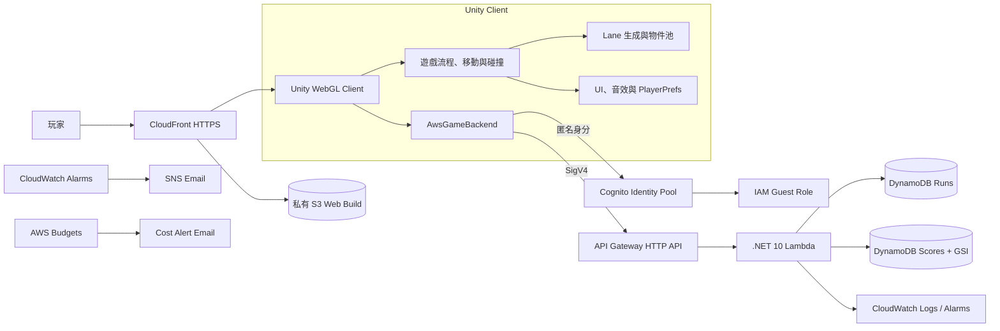
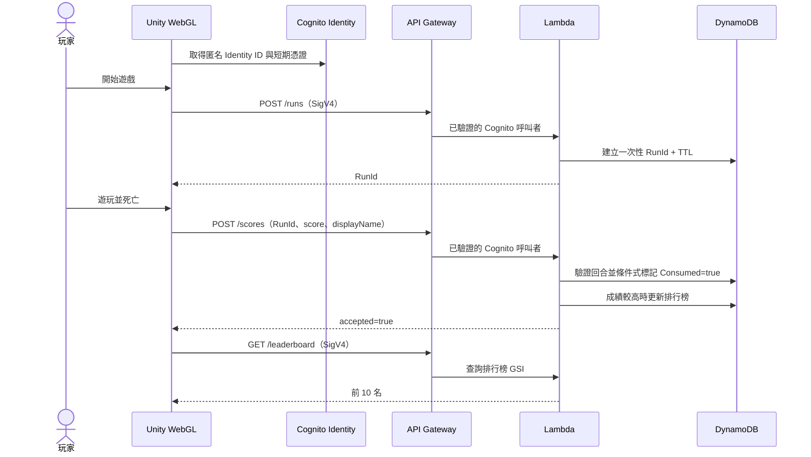

# Cross The Road 系統架構

本文件描述目前已上線的 AWS production 架構。舊版 Unity Gaming Services 資產仍保留於 repository，僅作為短期回復路徑，不是正式 Client 的預設後端。

## 執行架構

## 成績提交流程

## 安全邊界

- S3 Bucket 完全封鎖公開存取，只有 CloudFront Origin Access Control 可以讀取。
- Cognito Guest Role 只具備指定 API 的 `execute-api:Invoke`，不能直接存取 DynamoDB、S3 或 Lambda。
- 除 `/health` 外，所有 API route 都要求 AWS IAM／SigV4。
- Lambda 從 API Gateway 驗證後的 Cognito context 取得玩家身分，不信任 Request Body 自報的玩家 ID。
- `RunId` 僅能提交一次；伺服器驗證分數範圍、遊戲時間與最高合理得分速度。
- DynamoDB 啟用按需計費、刪除保護、時間點復原；回合資料以 TTL 清理。

## 正式資源

| Stack | 主要資源 |
| --- | --- |
| `CrossyRoadWebStack-production` | 私有 S3、CloudFront、OAC |
| `CrossyRoadIdentityStack-production` | Cognito Identity Pool、Guest IAM Role |
| `CrossyRoadApiStack-production` | HTTP API、.NET 10 Lambda、14 天 Log Group |
| `CrossyRoadDataStack-production` | Runs 與 Scores DynamoDB Tables、排行榜 GSI |
| `CrossyRoadMonitoringStack-production` | CloudWatch Alarms、SNS、AWS Budget |
| `CrossyRoadCiStack-production` | GitHub OIDC Provider、限定 main 分支的部署角色 |

## 維運設定

- 區域：`ap-northeast-1`（東京）。
- API 限流：每秒 10 次、突發 20 次，並啟用 route detailed metrics。
- 警報：Lambda Errors、Lambda Throttles、API 5xx、API p95 Latency。
- 成本通知：每月實際費用達 US$1、US$3、US$5。
- 正式環境 24 小時部署；Serverless 資源沒有流量時不產生常駐運算費。

## 部署與驗證

- 基礎設施：`infrastructure/` 的 AWS CDK v2 C# 專案。
- Lambda：`CrossyRoadServer/AwsBackend/`，共用驗證規則位於 `CrossyRoadServer/Domain/`。
- Web 發布：`infrastructure/scripts/Publish-WebBuild.ps1` 上傳 S3 並建立 CloudFront invalidation。
- 自動部署：GitHub Actions 透過 OIDC 取得短期 AWS 憑證；後端或 CDK 變更推送至 `main` 時部署 production stacks。
- 自動測試：驗證領域 23 項、CDK assertions 12 項。
- 健康檢查：`GET https://fpvx62ygkk.execute-api.ap-northeast-1.amazonaws.com/health`。

## 已知限制

- 匿名身分與 PlayerPrefs 可能因清除瀏覽器網站資料或更換裝置而改變。
- 目前只保存玩家顯示名稱與最高分，沒有帳號復原或跨裝置登入。
- 分數驗證是回合票證與合理性檢查，不是逐幀伺服器權威模擬。
- AWS 暫時不可用時，核心玩法仍可運行，但線上提交與排行榜會離線。
