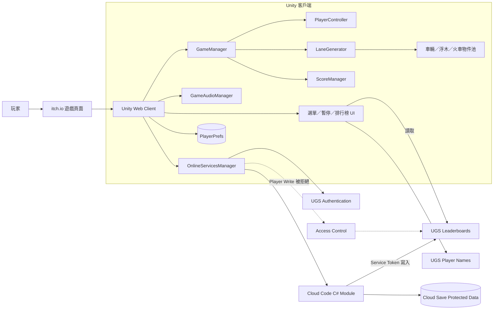
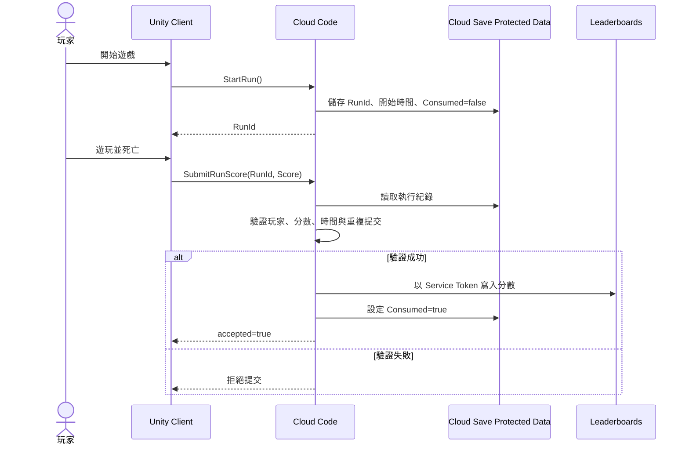

# Cross The Road 系統架構

## 執行架構

## 成績提交流程

## 安全邊界

- 玩家可直接讀取排行榜，以減少不必要的 Cloud Code 呼叫。
- `CrossyRoadAccessControl.ac` 禁止 `Player` 對 Leaderboards 執行任何寫入。
- Cloud Code 使用服務權杖寫入排行榜，不受玩家寫入限制影響。
- `RunId` 只能提交一次，避免同一局重放。
- 伺服器拒絕非正分、超過上限、超時或得分速度不合理的結果。
- Cloud Save Protected Data 不由一般客戶端修改。

## 部署單位

| 單位 | 位置 | 部署目的地 |
| --- | --- | --- |
| Unity Web Build | `Builds/Release/`（不進 Git） | itch.io |
| Cloud Code Module | `CrossyRoadServer/`、`Assets/CloudCode/CrossyRoadServer.ccmr` | UGS production |
| Access Control | `Assets/CloudCode/CrossyRoadAccessControl.ac` | UGS production |
| Unity Client Bindings | `Assets/CloudCode/GeneratedModuleBindings/` | 隨 Web Build 發布 |

## 已知限制

- 匿名帳號與瀏覽器本機資料可能因清除網站資料或更換裝置而改變。
- 目前驗證著重於執行票證、時間與分數合理性，並未在伺服器逐步模擬所有玩家操作。
- Cloud Code、Cloud Save 或 Leaderboards 暫時不可用時，核心玩法仍可運行，但線上提交與排行榜會受到影響。
