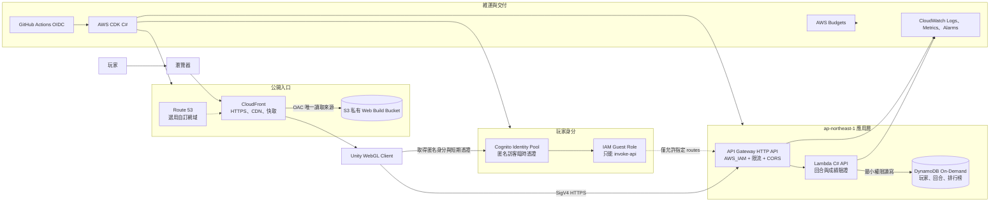
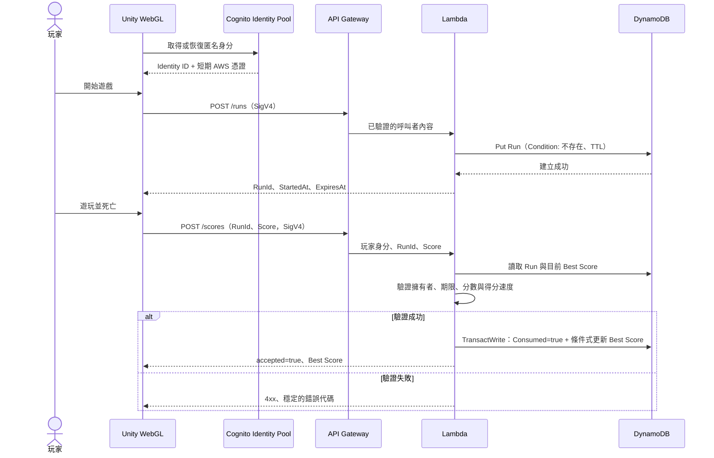

# Cross The Road：AWS 目標架構

## 決策狀態

- 狀態：已接受，作為 AWS 遷移的實作基準。
- 主要環境：`production`，24 小時保持可用。
- 主要區域：`ap-northeast-1`（東京）。
- 邊緣服務：Amazon CloudFront 為全球服務；日後若使用自訂網域，CloudFront 的 ACM 憑證建立於 `us-east-1`。
- 計費原則：使用 Serverless 與按量計費資源；不建立需要持續按小時計費的運算或網路資源。
- 現況：AWS 已是正式後端；UGS 資產暫時保留作為回復路徑。

## 架構目標

1. Unity Web Build、API、玩家身分、遊戲回合與排行榜都能由 AWS 提供。
2. 玩家不能直接修改排行榜或 DynamoDB；所有成績都必須經過伺服器驗證。
3. 正式環境可持續開啟，沒有流量時只留下極低的儲存與監控成本。
4. AWS 資源全部以 AWS CDK（C#）建立，能重建、審查並自動部署。
5. Unity 遊戲邏輯不直接依賴 UGS 或 AWS SDK；透過後端介面逐步遷移。

## 目標執行架構



## 服務選擇

| 領域 | AWS 服務 | 用途與理由 |
| --- | --- | --- |
| 靜態網站 | S3 + CloudFront | S3 Bucket 保持私有，由 CloudFront Origin Access Control 讀取；不啟用 S3 Website Endpoint。 |
| TLS／DNS | ACM + Route 53（選用） | 預設先使用 CloudFront 網址；需要品牌網域時才加入 Route 53 與不可匯出的 ACM 公開憑證。 |
| 匿名身分 | Cognito Identity Pools | 延續現有匿名玩家體驗，發出短期 AWS 憑證與穩定的 Cognito Identity ID。 |
| API | API Gateway HTTP API | 每條遊戲 API 使用 `AWS_IAM`，要求 Unity Client 以 SigV4 簽署；設定精確 CORS 與節流。 |
| 運算 | Lambda C# managed runtime | 執行玩家資料、回合建立、分數驗證及排行榜查詢；不使用常駐伺服器或 Provisioned Concurrency。 |
| 資料 | DynamoDB On-Demand | 依請求計費；以條件寫入與交易保證回合只能提交一次。 |
| 監控 | CloudWatch | 結構化記錄、錯誤率、節流與延遲；日誌保留 14 天。 |
| 成本控制 | AWS Budgets、服務配額 | 建立費用通知，並限制 API、Lambda 與 DynamoDB 的最大吞吐。 |
| 基礎設施 | AWS CDK C# | 所有正式資源、權限、警報與輸出都由程式碼建立。 |
| 部署 | GitHub Actions OIDC | 使用短期部署憑證，不在 GitHub 儲存長效 AWS Access Key。 |

## 信任與安全邊界

### 瀏覽器是不可信任端

- 分數、開始時間、玩家 ID、顯示名稱與 `RunId` 都不能只因為由 Client 傳來就被信任。
- Cognito Identity ID 從 API Gateway 驗證後的呼叫者內容取得，不接受 Request Body 自報的玩家 ID。
- Cognito Guest Role 只允許呼叫指定 API routes，不能直接存取 DynamoDB、S3 Bucket 或 Lambda。
- Unity Build 中不放置 AWS Secret Access Key、部署權限或 DynamoDB 權限。

### AWS 後端是唯一寫入路徑

- API Gateway 先驗證 SigV4 與 IAM 權限，再呼叫 Lambda。
- Lambda Execution Role 只允許讀寫指定資料表、寫入指定 Log Group。
- S3 Block Public Access 全部開啟，只有 CloudFront OAC 可讀取 Build。
- 正式環境限制 CORS origin；本機開發 origin 只存在於開發設定。
- API 回應不暴露 AWS 內部錯誤、Stack Trace、資料表名稱或玩家的臨時憑證。

## API 邊界

除健康檢查外，所有 routes 都要求 `AWS_IAM`。

| Method | Route | 用途 | 主要驗證 |
| --- | --- | --- | --- |
| `GET` | `/health` | 部署後健康檢查 | 無玩家資料，不讀寫 DynamoDB |
| `POST` | `/runs` | 開始新回合並取得 `RunId` | Cognito 呼叫者、一次性 ID、TTL |
| `POST` | `/scores` | 驗證並提交最終分數與顯示名稱 | 擁有者、一次性、期限、分數範圍與得分速度 |
| `GET` | `/leaderboard` | 取得排行榜前 10 名 | Cognito 呼叫者、固定查詢上限 |

API 使用固定的 JSON DTO 與版本前綴，不把 DynamoDB Item 或 Lambda 內部類別直接序列化給 Client。

## 成績提交流程



## DynamoDB 資料模型

第一版使用兩個受刪除保護的 On-Demand Tables：Runs 與 Scores。

| Item | PK | SK | 重要欄位 |
| --- | --- | --- | --- |
| 玩家最佳成績 | `LeaderboardId` | `PlayerId` | `Score`、`DisplayName`、`ScoreRank` |
| 遊戲回合 | `PlayerId` | `RunId` | `StartedAt`、`ExpiresAt`、`Consumed` |

排行榜 GSI：

- `LeaderboardId = global_high_scores`
- `ScoreRank = 反向分數 + 時間 + PlayerId`
- 由高至低 Query 取得前段名次。
- 同分玩家使用「高於該分數的人數 + 1」計算並列名次。
- 回合 Item 透過 DynamoDB TTL 自動清除；TTL 只負責清理，提交時仍必須自行檢查 `expiresAt`。
- 提交使用條件式交易，只有 `consumed = false` 的回合能成功一次。

## 可用性與失敗策略

- 靜態遊戲可在 API 暫時失敗時繼續載入；線上名稱與排行榜顯示「暫時無法使用」。
- Client 對安全的讀取操作使用有限次指數退避；分數提交不得無限重試。
- Lambda 設定逾時與記憶體；API Gateway route throttling 限制突發流量。
- DynamoDB 啟用刪除保護；正式資料保留策略與 CDK Stack 刪除分離。
- 每個 `RunId` 具有期限，因此網路中斷後不會永久留下可重放票證。

## 監控與成本護欄

- CloudWatch Logs 使用 JSON，包含 `requestId`、雜湊或受控格式的 `playerId`、`route`、`resultCode` 與延遲；不記錄臨時憑證或完整 Request Body。
- Log Retention 固定 14 天。
- Alarm：Lambda Errors、Lambda Throttles、API 5xx、API Latency。
- API Gateway 預設 route throttling 為每秒 10 次、突發 20 次；目前帳號 Lambda 併發配額為 10，保留併發會違反 AWS 最低未保留額度，因此不另外設定 Reserved Concurrency。
- AWS Budget 建立月費預警：`US$1`、`US$3`、`US$5`。
- S3 Lifecycle 清除過期部署版本，只保留目前版本與有限數量的回復版本。
- 不建立 NAT Gateway、EC2、RDS、OpenSearch、ElastiCache、常駐 ECS Service 或 Lambda Provisioned Concurrency。

## CDK Stack 邊界

已建立 `infrastructure/` C# solution，分成以下 Stacks：

| Stack | 主要資源 | 刪除策略 |
| --- | --- | --- |
| `CrossyRoadDataStack-production` | DynamoDB Table | `RETAIN`、刪除保護 |
| `CrossyRoadIdentityStack-production` | Cognito Identity Pool、Guest IAM Role | 可重建，但 production 不自動刪除 |
| `CrossyRoadApiStack-production` | HTTP API、Lambda、Log Group | 可重建 |
| `CrossyRoadWebStack-production` | S3 Web Bucket、CloudFront Distribution、OAC | Bucket 保留，其餘可重建 |
| `CrossyRoadDnsStack-production`（選用） | Route 53 Records、ACM Certificate | 加入自訂網域時建立 |
| `CrossyRoadMonitoringStack-production` | Budgets、CloudWatch Alarms、SNS | 可重建 |

Stack 透過明確輸出傳遞 API URL、CloudFront URL、Identity Pool ID 與 Region。Unity Client 只接收公開設定，不接收秘密值。

## Unity 後端抽象

遷移前先建立遊戲端服務介面，避免 UI 或 `GameManager` 直接呼叫 UGS／AWS：

```csharp
public interface IGameBackend
{
    string PlayerId { get; }
    Task InitializeAsync();
    Task<string> StartRunAsync();
    Task<bool> SubmitRunScoreAsync(string runId, int score, string displayName);
    Task<IReadOnlyList<GameLeaderboardEntry>> GetLeaderboardAsync(int limit);
}
```

目前實作包含：

- `AwsGameBackend`：包裝 Cognito 身分、SigV4 HTTP Client 與 AWS API DTO。
- `IGameBackend`：讓遊戲流程不直接依賴 AWS SDK 或供應商資料模型。
- 舊版 UGS 程式與部署資產暫時保留，但正式 `OnlineServicesManager` 固定使用 AWS。

WebGL 的 Cognito 憑證取得與 SigV4 簽署需要先做最小技術驗證；驗證結果將決定採用 Unity C# 實作或 `.jslib` JavaScript bridge，但不改變 API 與安全邊界。

## 正式環境部署模式

- `production` 24 小時保持部署，不排程刪除或關閉。
- Serverless 資源沒有請求時不產生常駐運算費；排程停用只會降低濫用風險，並非主要省錢手段。
- 正式資料與 Web Bucket 不會被一般 `cdk destroy` 刪除。
- 部署角色只能由指定 GitHub repository、branch／environment 透過 OIDC Assume Role。
- itch.io 與 UGS 在切換後的觀察期內仍保留作為回復路徑。

## 遷移與切換條件

1. ✅ 將現有回合與分數驗證規則抽離成不依賴 UGS 的 `CrossyRoad.Domain`，並以單元測試固定規格。
2. ✅ 建立 CDK C# solution、production 設定、上述 Stack 邊界與基礎測試。
3. ✅ 相同 Web Build 已發布至私人 S3 + CloudFront，並確認 HTTPS、OAC、Brotli 標頭與快取失效流程。
4. ✅ 已建立 Cognito、HTTP API、C# Lambda 與受刪除保護的 DynamoDB，並驗證健康端點與 IAM 拒絕未簽章請求。
5. ✅ 實作 `AwsGameBackend` 與 SigV4，正式 Client 透過 `IGameBackend` 使用 AWS。
6. ✅ 已驗證 Cognito 身分、回合、提交、排行榜、重複提交與未簽章拒絕案例。
7. ✅ 已通過正式 Web Build、全新瀏覽器、安全邊界、成本預警與健康檢查；CloudWatch/SNS 警報已部署。
8. ✅ 正式 Client 已切換至 AWS；UGS 暫時保留作為回復窗口。

## 不在第一版範圍

- EC2、容器叢集或長時間執行的遊戲伺服器。
- RDS、Aurora、ElastiCache 或 OpenSearch。
- 伺服器逐幀重播與完全權威式遊戲模擬。
- 社群登入、電子郵件／簡訊驗證與付費功能。
- 多區域主動／主動資料複寫。
- 即時管理後台；第一版以 CloudWatch 與 AWS Console 維運。
